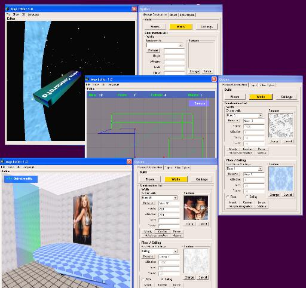



## Map Editor 1\.0b

### Description

With this first version of program, you can simply create a 2D map from the top view with mouse in a form and, with most option, you can convert this in 3D map and run away in.

The program allow to create normal and transparent multy-color walls, floors, ceilings and you can add .x , .3ds object.

Besides this program support Italian end english lenguage.

In this versione i've resolved a littles bug!

If You like it, vote for me ^_^
 
### More Info
 
There aren't true input.

You must simply draw with mouse a 2d map from top view and later convert that in 3d!

This program use Directx8 and Truevision 3D libraries.

The program return a perfect conversion of 2d map in 3d map.

             |
---                |---
**Submitted On**   |2002-10-13 11:36:58
**By**             |[Andrea Cammarata](https://github.com/Planet-Source-Code/PSCIndex/blob/master/ByAuthor/andrea-cammarata.md)
**Level**          |Intermediate
**User Rating**    |4.9 (44 globes from 9 users)
**Compatibility**  |VB 6\.0
**Category**       |[DirectX](https://github.com/Planet-Source-Code/PSCIndex/blob/master/ByCategory/directx__1-44.md)
**World**          |[Visual Basic](https://github.com/Planet-Source-Code/PSCIndex/blob/master/ByWorld/visual-basic.md)
**Archive File**   |[Map\_Editor1507101232002\.zip](https://github.com/Planet-Source-Code/andrea-cammarata-map-editor-1-0b__1-40152/archive/master.zip)

